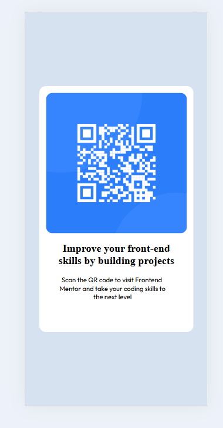

# Frontend Mentor - QR code component solution

This is a solution to the [QR code component challenge on Frontend Mentor](https://www.frontendmentor.io/challenges/qr-code-component-iux_sIO_H). 

## Table of contents

- [Overview](#overview)
  - [Screenshot](#screenshot)
  - [Links](#links)
- [My process](#my-process)
  - [Built with](#built-with)
  - [What I learned](#what-i-learned)
  - [Continued development](#continued-development)
  - [Useful resources](#useful-resources)
  - [AI Collaboration](#ai-collaboration)
- [Author](#author)
- [Acknowledgments](#acknowledgments)

**Note: Delete this note and update the table of contents based on what sections you keep.**

## Overview

### Screenshot

### Links

- Repo URL: [GitHub](https://github.com/sameer-khan-dev/Frontend-Mentor-Challenges/tree/main/QR%20Code%20Component/qr-code-component-main)
- Live Site: [Live Demo]()

## My process

### Built with

-Semantic HTML5 markup
-CSS custom properties
-Flexbox
-Google Fonts (Outfit)

### What I learned
 
This was a great first project for getting comfortable with HTML and CSS. A few things I practiced:

-Centering with Flexbox — Using display: flex, justify-content: center, and align-items: center on the body to center the card both horizontally and vertically on the page.
-The box model — Adding padding to the card container to give the content some breathing room inside.
-Border radius — Using border-radius to give the card and image rounded corners.
-Google Fonts — Linking an external font (Outfit) and applying it with font-family in CSS.

### Continued development

In future projects, I'd like to get more comfortable with:

-Responsive design and media queries
-Using relative units (rem, %) instead of fixed pixel values
-CSS custom properties (variables) for colors and spacing
 

## Author

- Website - [Add your name here](https://www.your-site.com)
- Frontend Mentor - [@yourusername](https://www.frontendmentor.io/profile/yourusername)
- Twitter - [@yourusername](https://www.twitter.com/yourusername)

**Note: Delete this note and add/remove/edit lines above based on what links you'd like to share.**

## Acknowledgments

This is where you can give a hat tip to anyone who helped you out on this project. Perhaps you worked in a team or got some inspiration from someone else's solution. This is the perfect place to give them some credit.

**Note: Delete this note and edit this section's content as necessary. If you completed this challenge by yourself, feel free to delete this section entirely.**
