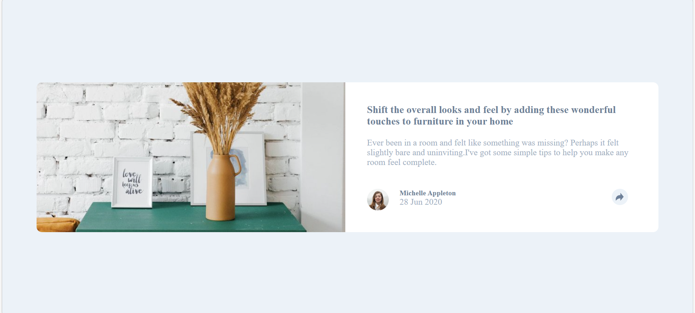
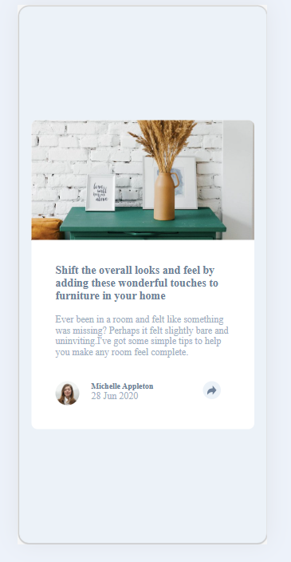

# Frontend Mentor - Article preview component solution

This is a solution to the [Article preview component challenge on Frontend Mentor](https://www.frontendmentor.io/challenges/article-preview-component-dYBN_pYFT).
## Table of contents

- [Overview](#overview)
  - [The challenge](#the-challenge)
  - [Screenshot](#screenshot)
  - [Links](#links)
- [My process](#my-process)
  - [Built with](#built-with)
  - [What I learned](#what-i-learned)
  - [Continued development](#continued-development)
  - [Author](#author)

## Overview

### The challenge

Users should be able to:

- View the optimal layout for the component depending on their device's screen size
- See the social media share links when they click the share icon

### Screenshot

  ### Screenshot
 
 

### Links

- Solution URL: [click me!](https://github.com/sameer-khan-dev/Frontend-Mentor-Challenges/tree/main/article-preview-component-master)
- Live Site URL: [click me!](https://sameer-khan-dev.github.io/Frontend-Mentor-Challenges/article-preview-component-master/)
 
## My process

### Built with

- Semantic HTML5 markup
- CSS Flexbox
- Vanilla JavaScript (DOM manipulation)
- Mobile-first responsive design

### What I learned

Working on this project helped me understand how to toggle UI states using JavaScript. One key thing I practiced was using `classList.toggle()` to show and hide the share bar, and dynamically creating and removing elements like icons using `createElement` and `prepend`.

I also got more comfortable with CSS Flexbox for laying out the profile section and centering the card on the page using `display: flex` on the `body`.

### Continued development

In future projects I want to:

- Get better at writing cleaner, more readable JavaScript
- Practice CSS transitions and animations for smoother UI changes
- Improve my understanding of responsive design for more complex layouts

## Author

- Frontend Mentor - [@sameer-khan-dev](https://www.frontendmentor.io/profile/sameer-khan-dev)
- GitHub - [@sameer-khan-dev](https://github.com/sameer-khan-dev)
