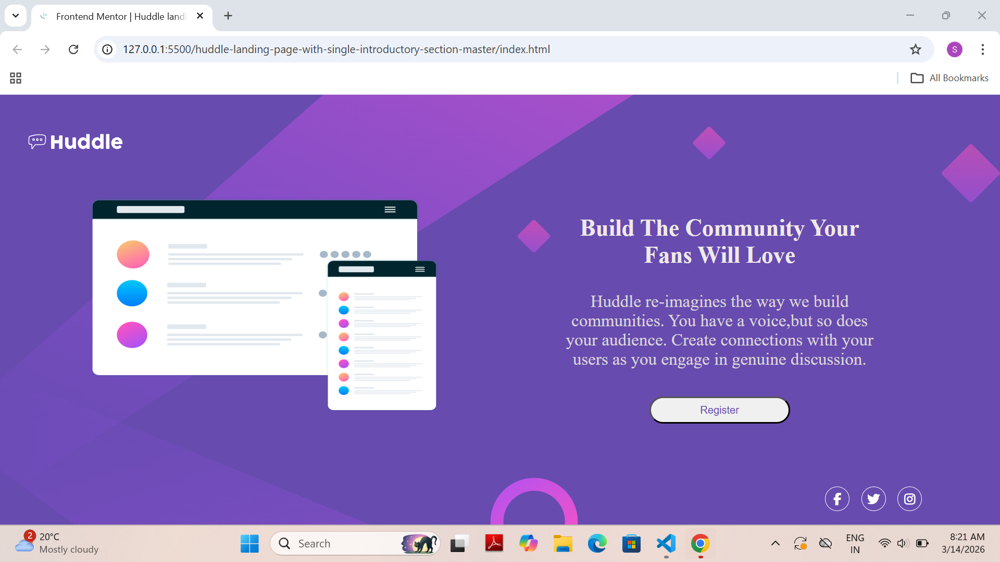
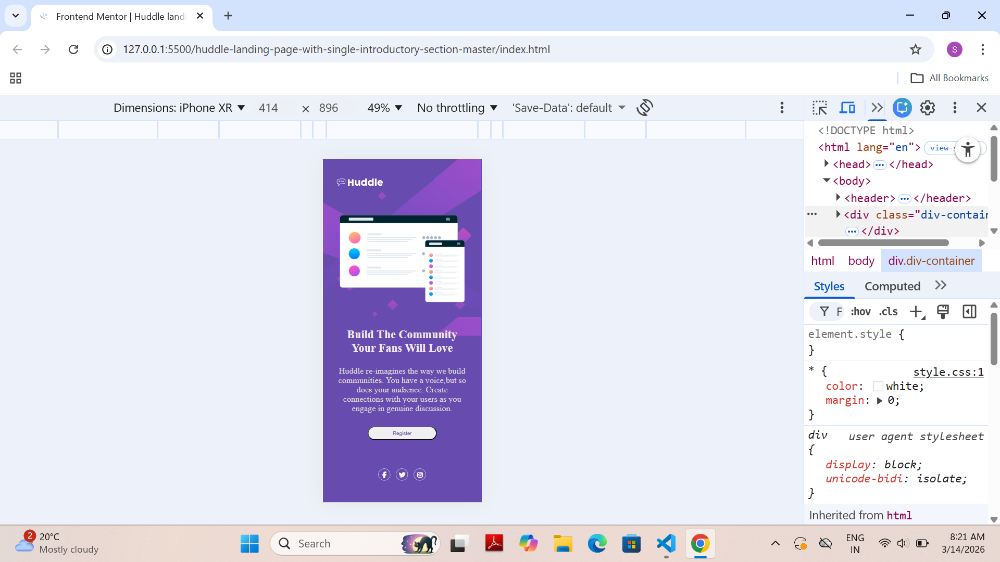

# Frontend Mentor - Huddle Landing Page Solution

This is my solution to the [Huddle landing page with single 
introductory section challenge on Frontend Mentor]
(https://www.frontendmentor.io/challenges/huddle-landing-page-with-a-single-introductory-section-B_2Wvxgi0).

## Table of contents
- [Overview](#overview)
- [My process](#my-process)
- [AI Collaboration](#ai-collaboration)
- [Author](#author)

## Overview

### The challenge
Users should be able to:
- View optimal layout depending on screen size
- See hover states for all interactive elements

### Screenshot

### Links
- Repo URL: [GitHub](https://github.com/sameer-khan-dev/Frontend-Mentor-Challenges)
- Live Site: [Live Demo](https://sameer-khan-dev.github.io/Frontend-Mentor-Challenges/huddle-landing-page/)

## My process

### Built with
- Semantic HTML5
- CSS
- Flexbox
- Media queries
- Font Awesome icons

### What I learned
I learned how to properly structure HTML and 
how to apply CSS on multiple selectors together.
This was my first real project!

### Continued development
I want to improve my skills in making 
web pages responsive for all screen sizes.

## AI Collaboration
- **Tool used:** Claude (by Anthropic)
- **How I used it:** I used Claude as a mentor 
  to understand file structure, HTML/CSS concepts, 
  Git commands, and how to make the page responsive.
- **What worked well:** Breaking down concepts 
  step by step and getting guidance without 
  being given direct answers.
- **What I did:** All the actual coding, 
  structure, and design decisions were made by me.

## Author
- Name - Sameer Khan
- Frontend Mentor - [@sameer](https://www.frontendmentor.io/profile/sameerkhan821852-wq)
- GitHub - [sameer-khan-dev](https://github.com/sameer-khan-dev)